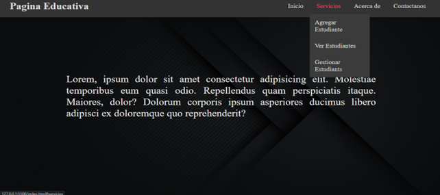
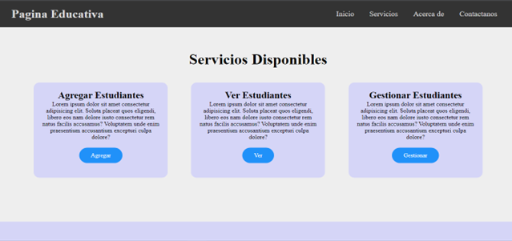
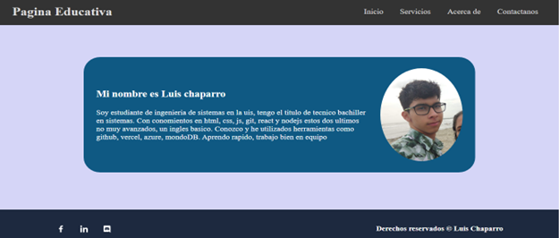
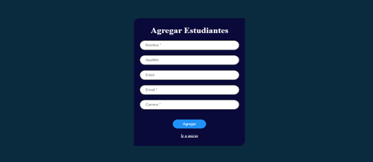
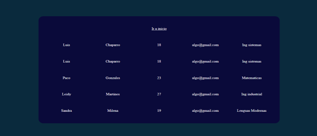

# paginaEducativa

Fui creando sección por sección de la pagina, para ir dandole el estilo a la sección de una vez, inicie haciendo la barra de navegación donde aplique display flex para organizar y la propiedad position fixed para fijar la barra de navegación ademas de tener un menu desplegable en el apartado de servicios. Luego hice la sección de inicio con solo un texto.

La parte de servicios con 3 cajas para mostrar cada uno de los servicios y permitir el acceso a otro pagina desde un boton. 

Luego me enfonque en presentarme como programador web, para así darme a conocer, hablando un poco sobre mi y mis conocimientos junto a un footer muy sencillo

Una vez con la estructura de la pagina inicial, continue con los servicios, tome un ejemplo de register que hicimos en clase, para diseñar la pagina de los servicios

